# [Bing Wallpapers](https://bing-wallpapers.vercel.app)  

### 2022-10-19 等等，这山上得有座城堡！  

  

|     |     |     | 
|:---:|:---:|:---:| 
|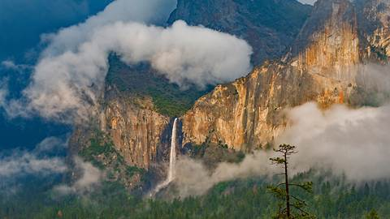  2022-10-18 [4K 版本](./static/2022-10-18-4k.jpg)   风之精灵|  2022-10-17 [4K 版本](./static/2022-10-17-4k.jpg)   “长耳”猫头鹰|  2022-10-16 [4K 版本](./static/2022-10-16-4k.jpg)   一座北部岛屿的南端|
|  2022-10-15 [4K 版本](./static/2022-10-15-4k.jpg)   国际考古日|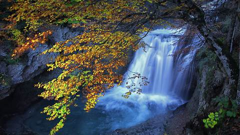  2022-10-14 [4K 版本](./static/2022-10-14-4k.jpg)   通往伊比利亚的门户|  2022-10-13 [4K 版本](./static/2022-10-13-4k.jpg)   驼鹿发情的季节|
|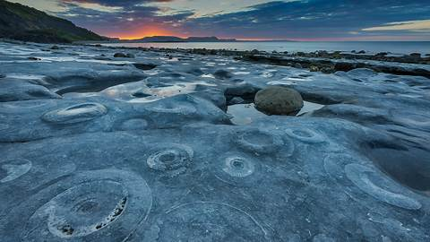  2022-10-12 [4K 版本](./static/2022-10-12-4k.jpg)   回到过去|  2022-10-11 [4K 版本](./static/2022-10-11-4k.jpg)   放大镜下的墙藓|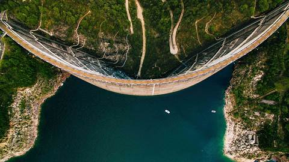  2022-10-10 [4K 版本](./static/2022-10-10-4k.jpg)   穿越意大利峡湾之旅|
|  2022-10-9 [4K 版本](./static/2022-10-9-4k.jpg)   什么生长得这样茂盛？|  2022-10-8 [4K 版本](./static/2022-10-8-4k.jpg)   透明的头足类动物|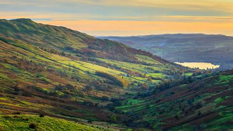  2022-10-7 [4K 版本](./static/2022-10-7-4k.jpg)   英国中部最美丽的风景|
|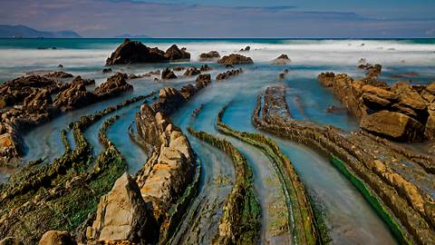  2022-10-6 [4K 版本](./static/2022-10-6-4k.jpg)   隐入大海的龙尾|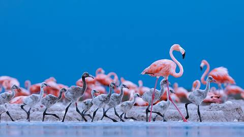  2022-10-5 [4K 版本](./static/2022-10-5-4k.jpg)   列队！|  2022-10-4 [4K 版本](./static/2022-10-4-4k.jpg)   今天我们去爬山吧|
|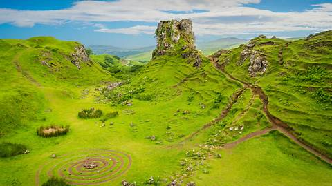  2022-10-3 [4K 版本](./static/2022-10-3-4k.jpg)   仙境之旅|  2022-10-2 [4K 版本](./static/2022-10-2-4k.jpg)   切斯瑞湖|  2022-10-1 [4K 版本](./static/2022-10-1-4k.jpg)   祖国生日快乐！|
|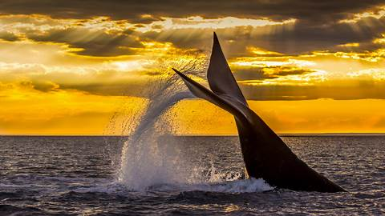  2022-9-30 [4K 版本](./static/2022-9-30-4k.jpg)   南冰洋里的巨鲸|  2022-9-29 [4K 版本](./static/2022-9-29-4k.jpg)   落基山脉的宝石|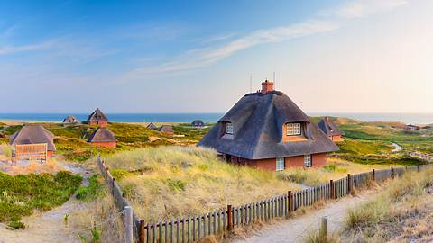  2022-9-21 [4K 版本](./static/2022-9-21-4k.jpg)   在西尔特的最南端|
|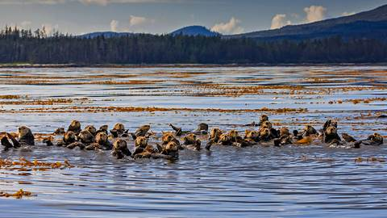  2022-9-20 [4K 版本](./static/2022-9-20-4k.jpg)   海上泰迪熊|  2022-9-19 [4K 版本](./static/2022-9-19-4k.jpg)   山峦间的光辉之城|  2022-9-18 [4K 版本](./static/2022-9-18-4k.jpg)   沉浸在大自然中|
|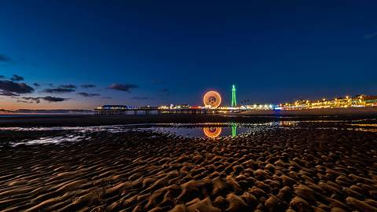  2022-9-17 [4K 版本](./static/2022-9-17-4k.jpg)   布莱克浦的灯光太棒了|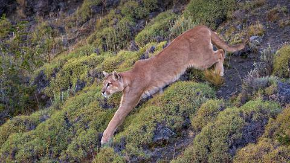  2022-9-16 [4K 版本](./static/2022-9-16-4k.jpg)   敏捷而隐秘|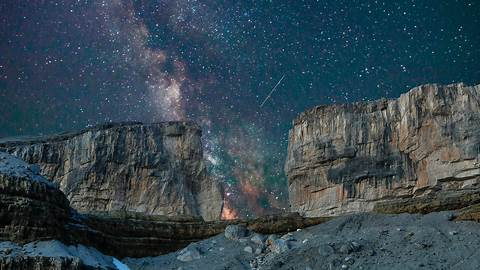  2022-9-15 [4K 版本](./static/2022-9-15-4k.jpg)   从天而降的魔法|
|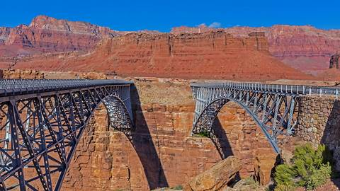  2022-9-14 [4K 版本](./static/2022-9-14-4k.jpg)   横跨峡谷裂缝的两座桥|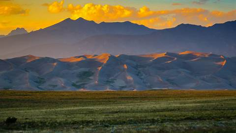  2022-9-13 [4K 版本](./static/2022-9-13-4k.jpg)   如沙漏中的沙子一般|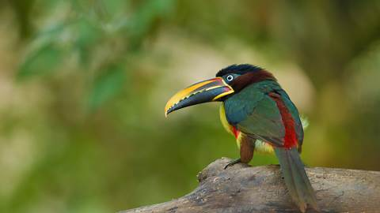  2022-9-12 [4K 版本](./static/2022-9-12-4k.jpg)   一种巨嘴鸟|
|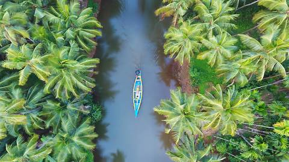  2022-9-11 [4K 版本](./static/2022-9-11-4k.jpg)   椰林国|  2022-9-10 [4K 版本](./static/2022-9-10-4k.jpg)   海上生明月，天涯共此时|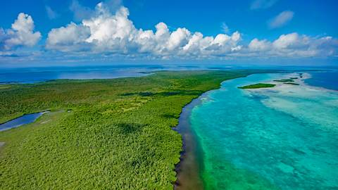  2022-9-9 [4K 版本](./static/2022-9-9-4k.jpg)   另一个大堡礁|
|  2022-9-8 [4K 版本](./static/2022-9-8-4k.jpg)   500年前，是谁回到了这座城市？|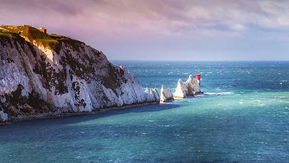  2022-9-7 [4K 版本](./static/2022-9-7-4k.jpg)   看起来很锋利的岩石|  2022-9-6 [4K 版本](./static/2022-9-6-4k.jpg)   一只有趣的小家伙|
|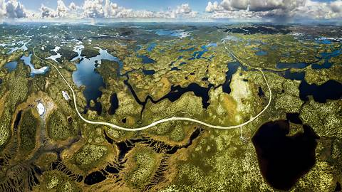  2022-9-5 [4K 版本](./static/2022-9-5-4k.jpg)   一次偏远的旅途|  2022-9-4 [4K 版本](./static/2022-9-4-4k.jpg)   印度的里维埃拉|  2022-9-3 [4K 版本](./static/2022-9-3-4k.jpg)   一双高耸入云的摩天大楼|
|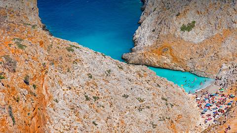  2022-9-2 [4K 版本](./static/2022-9-2-4k.jpg)   这个神奇的海滩值得一游|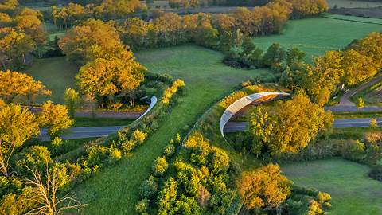  2022-9-1 [4K 版本](./static/2022-9-1-4k.jpg)   谁在使用这座绿草如茵的桥？|  2022-8-31 [4K 版本](./static/2022-8-31-4k.jpg)   漂在海里的蓝色星星|
|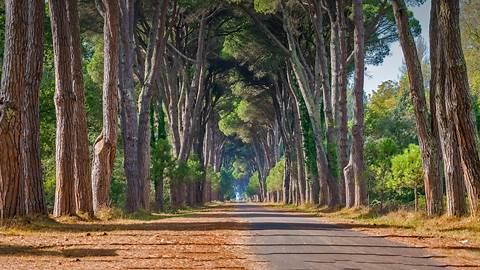  2022-8-30 [4K 版本](./static/2022-8-30-4k.jpg)   比萨不仅有斜塔|  2022-8-29 [4K 版本](./static/2022-8-29-4k.jpg)   像湖一样的大海|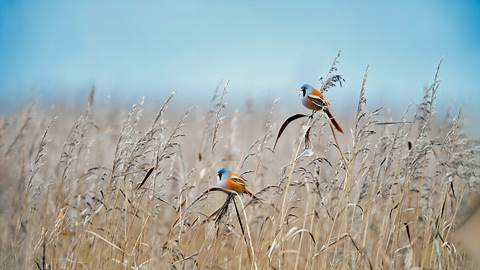  2022-8-28 [4K 版本](./static/2022-8-28-4k.jpg)   这鸟长着小胡子|
|  2022-8-27 [4K 版本](./static/2022-8-27-4k.jpg)   40年的休养生息|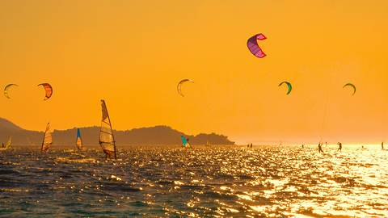  2022-8-26 [4K 版本](./static/2022-8-26-4k.jpg)   既有风，又有水|  2022-8-25 [4K 版本](./static/2022-8-25-4k.jpg)   令人惊叹的后花园|
|  2022-8-24 [4K 版本](./static/2022-8-24-4k.jpg)   里约热内卢的象征|  2022-8-23 [4K 版本](./static/2022-8-23-4k.jpg)   到了芒通，就来点柠檬汁吧|  2022-8-22 [4K 版本](./static/2022-8-22-4k.jpg)   猫头鹰界的叛逆小鸟|
|  2022-8-21 [4K 版本](./static/2022-8-21-4k.jpg)   死亡海岸|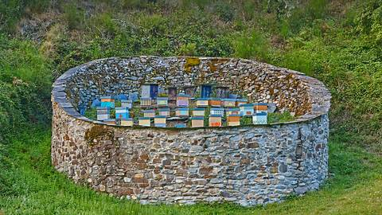  2022-8-20 [4K 版本](./static/2022-8-20-4k.jpg)   保护蜜蜂、赞美蜜蜂|  2022-8-19 [4K 版本](./static/2022-8-19-4k.jpg)   彭赞斯全景|
|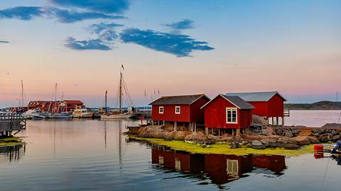  2022-8-18 [4K 版本](./static/2022-8-18-4k.jpg)   世界最臭食物之乡？|  2022-8-17 [4K 版本](./static/2022-8-17-4k.jpg)   如此清澈，如此洁净|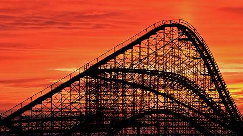  2022-8-16 [4K 版本](./static/2022-8-16-4k.jpg)   惊险之旅|
|  2022-8-15 [4K 版本](./static/2022-8-15-4k.jpg)   古代中世纪城堡|  2022-8-14 [4K 版本](./static/2022-8-14-4k.jpg)   捉迷藏世界冠军|  2022-8-13 [4K 版本](./static/2022-8-13-4k.jpg)   一颗值得的心|
|  2022-8-12 [4K 版本](./static/2022-8-12-4k.jpg)   家庭出游|  2022-8-11 [4K 版本](./static/2022-8-11-4k.jpg)   如果可以的话，请拥抱一座山吧|  2022-8-10 [4K 版本](./static/2022-8-10-4k.jpg)   沙漠中的匕首？|
|  2022-8-9 [4K 版本](./static/2022-8-9-4k.jpg)   9000年前的手印|  2022-8-8 [4K 版本](./static/2022-8-8-4k.jpg)   汪洋中的小岛|  2022-8-7 [4K 版本](./static/2022-8-7-4K.jpg)   贴秋膘了吗？|
|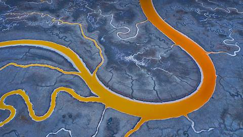  2022-8-6 [4K 版本](./static/2022-8-6-4k.jpg)   旧金山湾的盐滩