# [Bing Wallpapers](https://bing-wallpapers.vercel.app)  

### 2022-12-19 一抹鲜艳的色彩  

  

|     |     |     | 
|:---:|:---:|:---:| 
|  2022-12-18 [4K 版本](./static/2022-12-18-4k.jpg)   通往拉丁美洲的门户|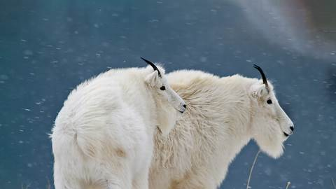  2022-12-17 [4K 版本](./static/2022-12-17-4k.jpg)   它们对你也同样好奇|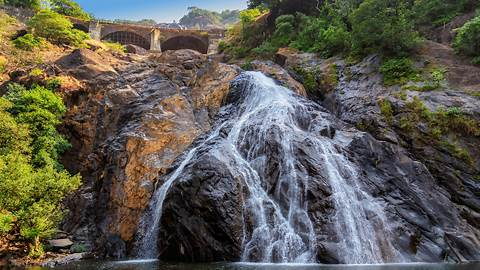  2022-12-16 [4K 版本](./static/2022-12-16-4k.jpg)   令人难忘的景色|
|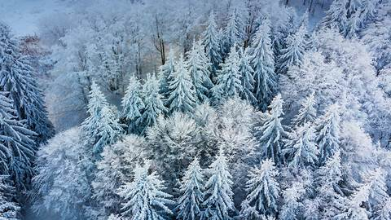  2022-12-15 [4K 版本](./static/2022-12-15-4k.jpg)   冬季仙境|  2022-12-14 [4K 版本](./static/2022-12-14-4k.jpg)   意大利最古老的国家公园|  2022-12-13 [4K 版本](./static/2022-12-13-4k.jpg)   哈尔施塔特，奥地利|
|  2022-12-12 [4K 版本](./static/2022-12-12-4k.jpg)   假日色调|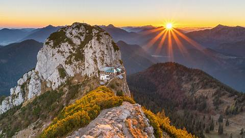  2022-12-11 [4K 版本](./static/2022-12-11-4k.jpg)   国际山岳日|  2022-12-10 [4K 版本](./static/2022-12-10-4k.jpg)   一小撮盐可不够|
|  2022-12-9 [4K 版本](./static/2022-12-9-4k.jpg)   这些古老的动物是什么？|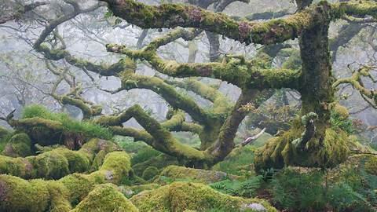  2022-12-8 [4K 版本](./static/2022-12-8-4k.jpg)   这些古老的动物是什么？|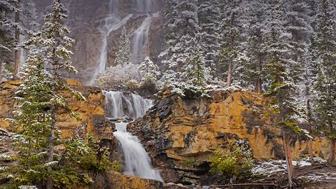  2022-12-7 [4K 版本](./static/2022-12-7-4k.jpg)   落基山脉的径流|
|  2022-12-6 [4K 版本](./static/2022-12-6-4k.jpg)   白鹭亮羽|  2022-12-5 [4K 版本](./static/2022-12-5-4k.jpg)   绿意盎然|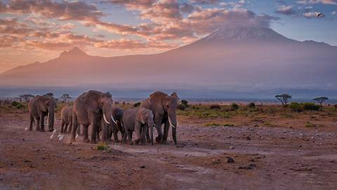  2022-12-4 [4K 版本](./static/2022-12-4-4k.jpg)   象群在路上|
|  2022-12-3 [4K 版本](./static/2022-12-3-4k.jpg)   在艺术天堂追逐夏天|  2022-12-2 [4K 版本](./static/2022-12-2-4k.jpg)   保护阿拉斯加的自然之美|  2022-12-1 [4K 版本](./static/2022-12-1-4k.jpg)   江泽民逝世|
|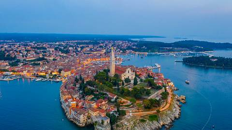  2022-11-30 [4K 版本](./static/2022-11-30-4k.jpg)   亚得里亚海边的明珠|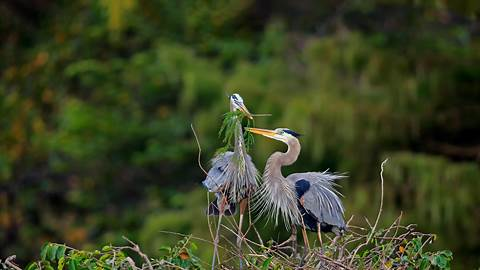  2022-11-29 [4K 版本](./static/2022-11-29-4k.jpg)   付出和给予的一天|  2022-11-28 [4K 版本](./static/2022-11-28-4k.jpg)   太阳系的第四颗行星|
|  2022-11-27 [4K 版本](./static/2022-11-27-4k.jpg)   不可思议的树叶|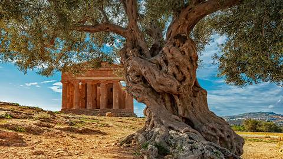  2022-11-26 [4K 版本](./static/2022-11-26-4k.jpg)   和平的象征|  2022-11-25 [4K 版本](./static/2022-11-25-4k.jpg)   科雷兹的宝石|
|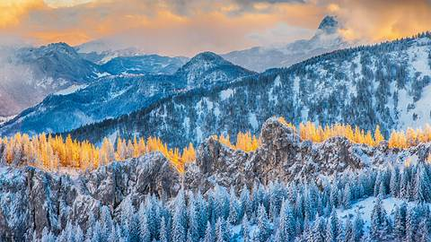  2022-11-24 [4K 版本](./static/2022-11-24-4k.jpg)   令人惊叹的山顶美景|  2022-11-23 [4K 版本](./static/2022-11-23-4k.jpg)   自然、艺术和数学|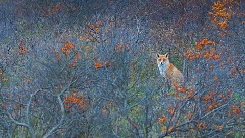  2022-11-22 [4K 版本](./static/2022-11-22-4k.jpg)   赤狐|
|  2022-11-21 [4K 版本](./static/2022-11-21-4k.jpg)   令人陶醉的海岛花园|  2022-11-20 [4K 版本](./static/2022-11-20-4k.jpg)   深空中的金色悬崖|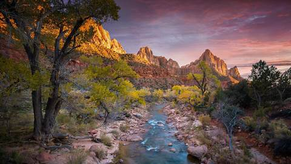  2022-11-19 [4K 版本](./static/2022-11-19-4k.jpg)   历经百年的锡安国家公园|
|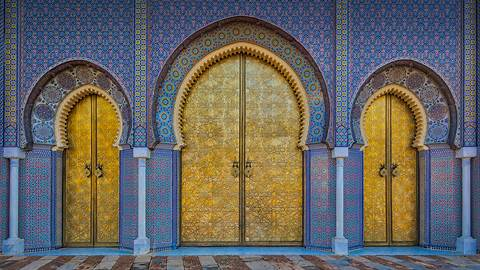  2022-11-18 [4K 版本](./static/2022-11-18-4k.jpg)   通往皇宫的大门|  2022-11-17 [4K 版本](./static/2022-11-17-4k.jpg)   徒步旅行|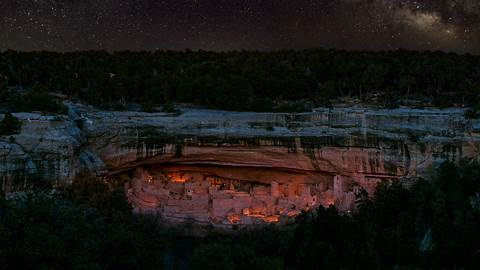  2022-11-16 [4K 版本](./static/2022-11-16-4k.jpg)   《保护世界文化和自然遗产公约》|
|  2022-11-15 [4K 版本](./static/2022-11-15-4k.jpg)   北美水獭|  2022-11-14 [4K 版本](./static/2022-11-14-4k.jpg)   爱琴海之巅|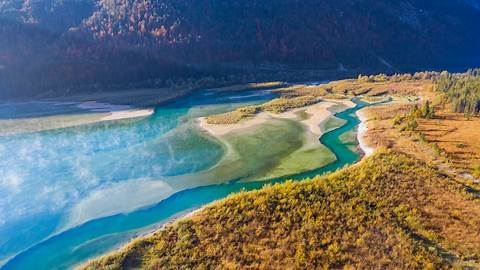  2022-11-13 [4K 版本](./static/2022-11-13-4k.jpg)   美丽清澈的河流|
|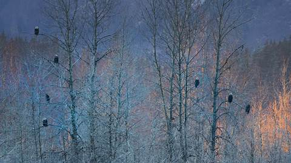  2022-11-12 [4K 版本](./static/2022-11-12-4k.jpg)   秃鹰的集会|  2022-11-11 [4K 版本](./static/2022-11-11-4k.jpg)   沙漠中的绿洲|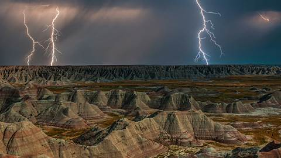  2022-11-10 [4K 版本](./static/2022-11-10-4k.jpg)   恶地国家公园的一场闪电？|
|  2022-11-9 [4K 版本](./static/2022-11-9-4k.jpg)   可以观赏，请勿触碰|  2022-11-8 [4K 版本](./static/2022-11-8-4k.jpg)   祝福和祈愿的日子|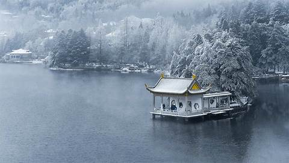  2022-11-7 [4K 版本](./static/2022-11-7-4k.jpg)   冬天来了|
|  2022-11-6 [4K 版本](./static/2022-11-6-4k.jpg)   跑过纽约五个行政区|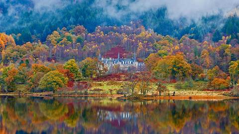  2022-11-5 [4K 版本](./static/2022-11-5-4k.jpg)   重温往日辉煌|  2022-11-4 [4K 版本](./static/2022-11-4-4k.jpg)   落基山上碧玉腰带|
|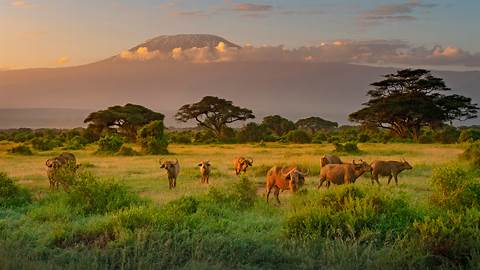  2022-11-3 [4K 版本](./static/2022-11-3-4k.jpg)   一个关于可持续发展的实验|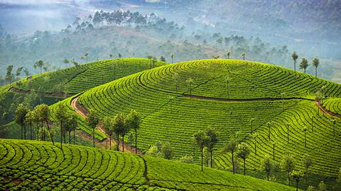  2022-11-2 [4K 版本](./static/2022-11-2-4k.jpg)   您喝的茶可能来自这里|  2022-11-1 [4K 版本](./static/2022-11-1-4k.jpg)   来一盏微笑的南瓜灯吗？|
|  2022-10-31 [4K 版本](./static/2022-10-31-4k.jpg)   是谁躲在这令人毛骨悚然的树林里？|  2022-10-30 [4K 版本](./static/2022-10-30-4k.jpg)   北极之王|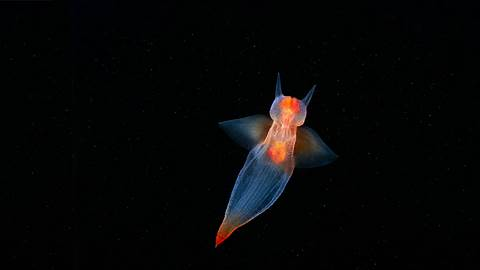  2022-10-29 [4K 版本](./static/2022-10-29-4k.jpg)   海洋天使|
|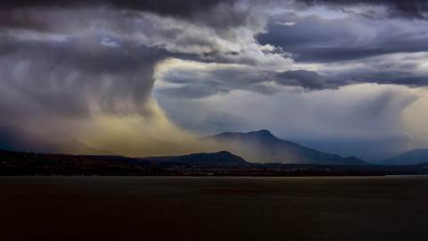  2022-10-28 [4K 版本](./static/2022-10-28-4k.jpg)   一个黑暗的暴风雨之夜|  2022-10-27 [4K 版本](./static/2022-10-27-4k.jpg)   一个吻和一声叹息|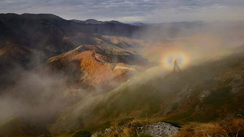  2022-10-26 [4K 版本](./static/2022-10-26-4k.jpg)   山上的幽灵|
|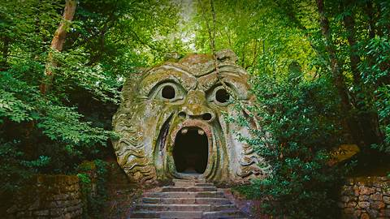  2022-10-25 [4K 版本](./static/2022-10-25-4k.jpg)   怪物公园|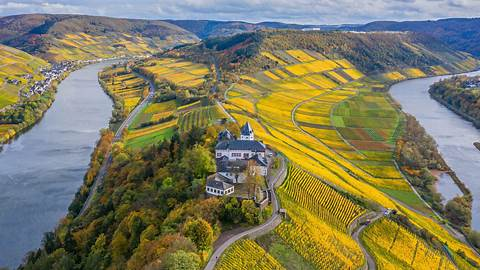  2022-10-24 [4K 版本](./static/2022-10-24-4k.jpg)   维尔茨堡美因河畔的一座城堡|  2022-10-23 [4K 版本](./static/2022-10-23-4k.jpg)   疣鼻天鹅|
|  2022-10-22 [4K 版本](./static/2022-10-22-4k.jpg)   云山雾绕|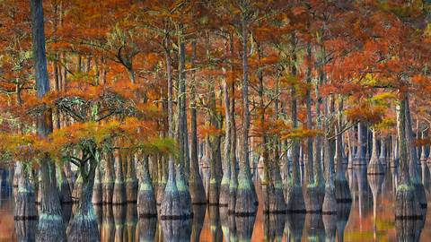  2022-10-21 [4K 版本](./static/2022-10-21-4k.jpg)   美国南部的别样秋景|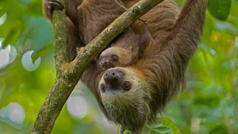  2022-10-20 [4K 版本](./static/2022-10-20-4k.jpg)   到哪都挂着|
|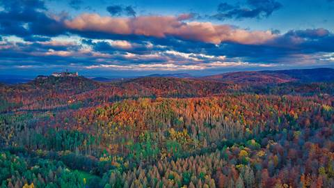  2022-10-19 [4K 版本](./static/2022-10-19-4k.jpg)   等等，这山上得有座城堡！|  2022-10-18 [4K 版本](./static/2022-10-18-4k.jpg)   风之精灵|  2022-10-17 [4K 版本](./static/2022-10-17-4k.jpg)   “长耳”猫头鹰|
|  2022-10-16 [4K 版本](./static/2022-10-16-4k.jpg)   一座北部岛屿的南端|  2022-10-15 [4K 版本](./static/2022-10-15-4k.jpg)   国际考古日|  2022-10-14 [4K 版本](./static/2022-10-14-4k.jpg)   通往伊比利亚的门户|
|  2022-10-13 [4K 版本](./static/2022-10-13-4k.jpg)   驼鹿发情的季节|  2022-10-12 [4K 版本](./static/2022-10-12-4k.jpg)   回到过去|  2022-10-11 [4K 版本](./static/2022-10-11-4k.jpg)   放大镜下的墙藓|
|  2022-10-10 [4K 版本](./static/2022-10-10-4k.jpg)   穿越意大利峡湾之旅|  2022-10-9 [4K 版本](./static/2022-10-9-4k.jpg)   什么生长得这样茂盛？|  2022-10-8 [4K 版本](./static/2022-10-8-4k.jpg)   透明的头足类动物|
|  2022-10-7 [4K 版本](./static/2022-10-7-4k.jpg)   英国中部最美丽的风景|  2022-10-6 [4K 版本](./static/2022-10-6-4k.jpg)   隐入大海的龙尾|  2022-10-5 [4K 版本](./static/2022-10-5-4k.jpg)   列队！|
|  2022-10-4 [4K 版本](./static/2022-10-4-4k.jpg)   今天我们去爬山吧|  2022-10-3 [4K 版本](./static/2022-10-3-4k.jpg)   仙境之旅|  2022-10-2 [4K 版本](./static/2022-10-2-4k.jpg)   切斯瑞湖|
|  2022-10-1 [4K 版本](./static/2022-10-1-4k.jpg)   祖国生日快乐！|  2022-9-30 [4K 版本](./static/2022-9-30-4k.jpg)   南冰洋里的巨鲸|  2022-9-29 [4K 版本](./static/2022-9-29-4k.jpg)   落基山脉的宝石|
|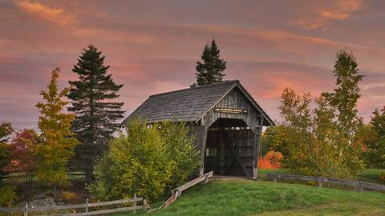  2022-9-28 [4K 版本](./static/2022-9-28-4k.jpg)   现代娱乐|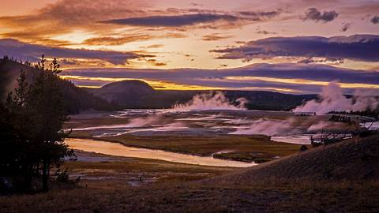  2022-9-27 [4K 版本](./static/2022-9-22-4k.jpg)   水火交汇处|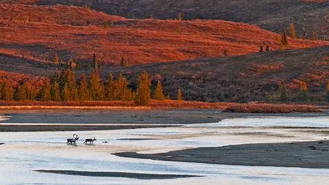  2022-9-26 [4K 版本](./static/2022-9-26-4k.jpg)   是时候给人留下印象了|
|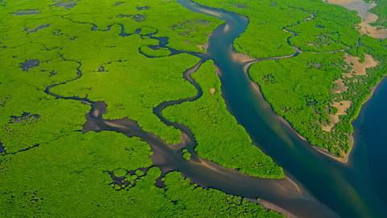  2022-9-25 [4K 版本](./static/2022-9-22-4k.jpg)   河流流经我们|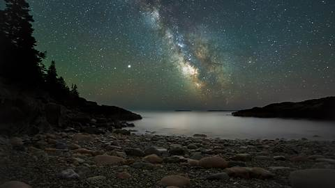  2022-9-24 [4K 版本](./static/2022-9-22-4k.jpg)   繁星满天的夜晚|  2022-9-23 [4K 版本](./static/2022-9-22-4k.jpg)   秋季颜色|
|  2022-9-22 [4K 版本](./static/2022-9-22-4k.jpg)   一个小而强大的守护者|  2022-9-21 [4K 版本](./static/2022-9-21-4k.jpg)   在西尔特的最南端|  2022-9-20 [4K 版本](./static/2022-9-20-4k.jpg)   海上泰迪熊|
|  2022-9-19 [4K 版本](./static/2022-9-19-4k.jpg)   山峦间的光辉之城|  2022-9-18 [4K 版本](./static/2022-9-18-4k.jpg)   沉浸在大自然中|  2022-9-17 [4K 版本](./static/2022-9-17-4k.jpg)   布莱克浦的灯光太棒了|
|  2022-9-16 [4K 版本](./static/2022-9-16-4k.jpg)   敏捷而隐秘|  2022-9-15 [4K 版本](./static/2022-9-15-4k.jpg)   从天而降的魔法|  2022-9-14 [4K 版本](./static/2022-9-14-4k.jpg)   横跨峡谷裂缝的两座桥|
|  2022-9-13 [4K 版本](./static/2022-9-13-4k.jpg)   如沙漏中的沙子一般|  2022-9-12 [4K 版本](./static/2022-9-12-4k.jpg)   一种巨嘴鸟|  2022-9-11 [4K 版本](./static/2022-9-11-4k.jpg)   椰林国|
|  2022-9-10 [4K 版本](./static/2022-9-10-4k.jpg)   海上生明月，天涯共此时|  2022-9-9 [4K 版本](./static/2022-9-9-4k.jpg)   另一个大堡礁|  2022-9-8 [4K 版本](./static/2022-9-8-4k.jpg)   500年前，是谁回到了这座城市？|
|  2022-9-7 [4K 版本](./static/2022-9-7-4k.jpg)   看起来很锋利的岩石|  2022-9-6 [4K 版本](./static/2022-9-6-4k.jpg)   一只有趣的小家伙|  2022-9-5 [4K 版本](./static/2022-9-5-4k.jpg)   一次偏远的旅途|
|  2022-9-4 [4K 版本](./static/2022-9-4-4k.jpg)   印度的里维埃拉|  2022-9-3 [4K 版本](./static/2022-9-3-4k.jpg)   一双高耸入云的摩天大楼|  2022-9-2 [4K 版本](./static/2022-9-2-4k.jpg)   这个神奇的海滩值得一游|
|  2022-9-1 [4K 版本](./static/2022-9-1-4k.jpg)   谁在使用这座绿草如茵的桥？|  2022-8-31 [4K 版本](./static/2022-8-31-4k.jpg)   漂在海里的蓝色星星|  2022-8-30 [4K 版本](./static/2022-8-30-4k.jpg)   比萨不仅有斜塔|
|  2022-8-29 [4K 版本](./static/2022-8-29-4k.jpg)   像湖一样的大海|  2022-8-28 [4K 版本](./static/2022-8-28-4k.jpg)   这鸟长着小胡子|  2022-8-27 [4K 版本](./static/2022-8-27-4k.jpg)   40年的休养生息|
|  2022-8-26 [4K 版本](./static/2022-8-26-4k.jpg)   既有风，又有水|  2022-8-25 [4K 版本](./static/2022-8-25-4k.jpg)   令人惊叹的后花园|  2022-8-24 [4K 版本](./static/2022-8-24-4k.jpg)   里约热内卢的象征|
|  2022-8-23 [4K 版本](./static/2022-8-23-4k.jpg)   到了芒通，就来点柠檬汁吧|  2022-8-22 [4K 版本](./static/2022-8-22-4k.jpg)   猫头鹰界的叛逆小鸟|  2022-8-21 [4K 版本](./static/2022-8-21-4k.jpg)   死亡海岸|
|  2022-8-20 [4K 版本](./static/2022-8-20-4k.jpg)   保护蜜蜂、赞美蜜蜂|  2022-8-19 [4K 版本](./static/2022-8-19-4k.jpg)   彭赞斯全景|  2022-8-18 [4K 版本](./static/2022-8-18-4k.jpg)   世界最臭食物之乡？|
|  2022-8-17 [4K 版本](./static/2022-8-17-4k.jpg)   如此清澈，如此洁净|  2022-8-16 [4K 版本](./static/2022-8-16-4k.jpg)   惊险之旅|  2022-8-15 [4K 版本](./static/2022-8-15-4k.jpg)   古代中世纪城堡|
|  2022-8-14 [4K 版本](./static/2022-8-14-4k.jpg)   捉迷藏世界冠军|  2022-8-13 [4K 版本](./static/2022-8-13-4k.jpg)   一颗值得的心|  2022-8-12 [4K 版本](./static/2022-8-12-4k.jpg)   家庭出游|
|  2022-8-11 [4K 版本](./static/2022-8-11-4k.jpg)   如果可以的话，请拥抱一座山吧|  2022-8-10 [4K 版本](./static/2022-8-10-4k.jpg)   沙漠中的匕首？|  2022-8-9 [4K 版本](./static/2022-8-9-4k.jpg)   9000年前的手印|
|  2022-8-8 [4K 版本](./static/2022-8-8-4k.jpg)   汪洋中的小岛|  2022-8-7 [4K 版本](./static/2022-8-7-4K.jpg)   贴秋膘了吗？|  2022-8-6 [4K 版本](./static/2022-8-6-4k.jpg)   旧金山湾的盐滩|
